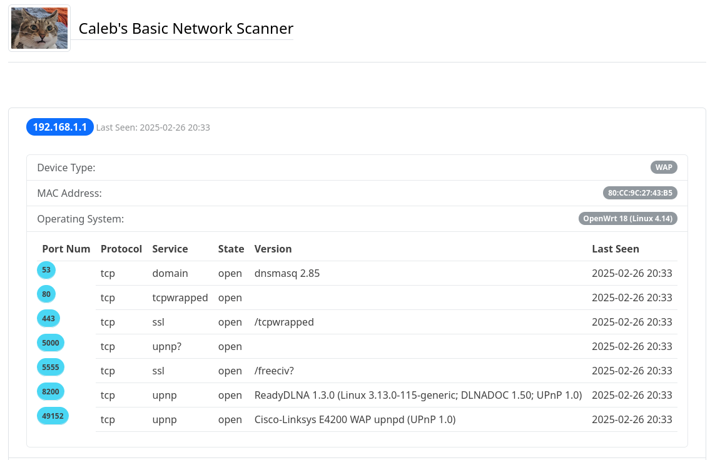

# Caleb's Basic Network Scanner (CBNS)

This is a simple network scanner. It uses nmap to find IPs on your home network, then port scans them.
It saves the results to a JSON file, and to individual files for analysis.
The JSON file is used by the local server to power the dashboard (dashboard.html)




## General Flow

    1. Run scanner (or set up a daemon to run every few hours)
    2. Once at least one successful scan is complete, start the local server (servelocally.sh)
    3. Go to ```localhost:8080/dashboard.html```

## Usage

### Run The CBNS

- ```$> sudo python3 basic_network_scanner.py```
    - This will take some time.
    - You can view the logs in the networkscanner.log file
        - ```$> tail networkscanner.log -f -n100```

### Run The Dashboard

1. ```$> ./servelocally.sh```
    - NOTE: This script will take the HOME directory from settings.py and host it.
    - NOTE: This script assumes that ```/bin/python``` exists. Modify accordingly if required.

2. Open browser and go to ```localhost:8080/dashboard.html```
    - NOTE: At least one run must have been completed and a state.json file created from it.


## Requirements

- Python 3
- nmap
- A Linux Operating System (Though the scripts can be modified to work with Windows)


## Automation

Here are some quick steps to set up automated scans on your network using systemd timers.

1. Create a systemd timer file: ```sudo vim /etc/systemd/system/calebs_networkscanner.timer```

2. Enter the timer information (every 2 hours) like the example below and save (```:wq```):
    ```
    [Unit]
    Description=Calebs Network Scanner Timer

    [Timer]
    OnCalendar=*-*-* 00/2:00:00
    Persistent=true
    Unit=calebs_networkscanner.service

    [Install]
    WantedBy=multi-user.target
    ```
3. Create the service you reference in your timer file (ex: calebs_networkservice.service)
    ```sudo vim /etc/systemd/system/calebs_networkscanner.service```

4. Enter the service information like the example below, change ```<PATH TO NETWORK SCANNER>``` to the actual path to your network scanner, and save (```:wq```):
    ```
    [Unit]
    Description=Calebs Network Scanner Job

    [Service]
    Type=simple
    Restart=always
    ExecStart=/usr/bin/python <PATH TO NETWORK SCANNER>/basic_network_scanner.py
    ```

5. Reload the daemon: ```sudo systemctl daemon-reload```

6. Enable your timer: ```sudo systemctl enable calebs_networkscanner.timer```

7. Start your timer: ```sudo systemctl start calebs_networkscanner.timer```

8. Check the status of your timer: ```sudo systemctl status calebs_networkscanner.timer```
    - Can also use: ```sudo journalctl -u calebs_networkscanner```
    - Can also check the network scanner's log: ```tail networkscanner.log -f -n100```

9. Now the network scanner will run every 2 hours (if you used the example).
    - If you want to see the results in the dashboard, refer to the Usage section above.


